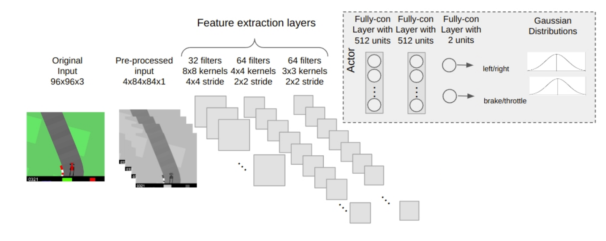

# 🚗 Clonagem Comportamental (Behavior Cloning)

**Clonagem Comportamental (CC)** é uma técnica de *Aprendizado por Imitação* em que um modelo supervisionado (geralmente uma rede neural) aprende a imitar o comportamento de um especialista. Esse processo utiliza um conjunto de dados fixo com pares observação-ação ou trajetórias capturadas durante a execução da tarefa pelo especialista.

O exemplo desse repositório é o uso da CC em direção autônoma, em que as entradas são imagens captadas no ambiente simulado e as saídas representam os comandos de direção, aceleração e frenagem.

---

## 📦 1. Simulação e Coleta de Dados

- **Simulador:** Utilizamos o ambiente [`CarRacing-v0`](https://github.com/openai/gym/blob/master/gym/envs/box2d/car_racing.py) da OpenAI Gym. Esse é um ambiente de controle contínuo com imagens RGB como entrada.

- **Pré-processamento dos Dados:**
  - Conversão das imagens para escala de cinza (P&B).
  - *Stacking* temporal de 4 frames consecutivos para capturar a dinâmica.
  - Ações representadas no formato: `[steering, brake, throttle]`.

---

## 🧠 2. Treinamento e Avaliação

- **Modelo:** A rede neural utilizada é uma CNN (Rede Neural Convolucional) baseada na proposta por [Irving2023](https://repositorio.ufsc.br/handle/123456789/251825).

<p align="center">
  
</p>

- O treinamento supervisionado é realizado com base nas observações e ações coletadas, buscando minimizar o erro entre as ações previstas e as ações reais do especialista.

---


## ⚙️ 3. Como Executar o Projeto

Acesse o diretório `src` e execute:

```bash
make run
```

Esse comando:

- Cria um ambiente virtual.
- Instala automaticamente as dependências.
- Executa o script `main.py` para treinar e avaliar a rede neural.

Alterações no script `main.py` possibilitam diferentes formas de treinamento, como aumento do número de épocas, modificação dos parâmetros, etc.

Alterações na rede neural podem ser feitas em `cnn.py`.

---

## ⚙️ 4. Como Gerar Dados de Especialista

Acesse o diretório `src` e execute:

```bash
make expert
```

Esse comando:

- Executa o script `car_racing_v0.py` que permite que o usuário gere dados de trajetória de especialista.

As setas do teclado permitem movimentar o carro, acelerando ou freiando.

Os dados são salvos em um .pkl em `src/data/trajectories`, os quais registram os pares observação e ação.


---

### 📊 Visualização de Resultados

Para visualizar os gráficos de desempenho (*reward*), execute:

```bash
make plot
```

## 📚 Referências

### Tutoriais de Regressão e CNNs com PyTorch:

- [PyTorch - Definindo uma Rede Neural](https://pytorch.org/tutorials/recipes/recipes/defining_a_neural_network.html)
- [Simple Regression with Neural Networks (Medium)](https://medium.com/@benjamin.phillips22/simple-regression-with-neural-networks-in)
- [PyTorch Tutorial - Guru99](https://www.guru99.com/pytorch-tutorial.html)
- [Notebook no Google Colab](https://colab.research.google.com/drive/1IWRgLeTug-7NphtB54iDz8aJEi_OpWbQ?usp=sharing)

### Artigos sobre Clonagem Comportamental:

- [Imitation learning for autonomous driving: disagreement-regularization and behavior cloning with beta distribution](https://repositorio.ufsc.br/handle/123456789/251825)

---

## 🤝 Contribuindo

Contribuições são bem-vindas! Caso deseje propor melhorias, abra uma *issue* ou envie um *pull request* com suas alterações.
